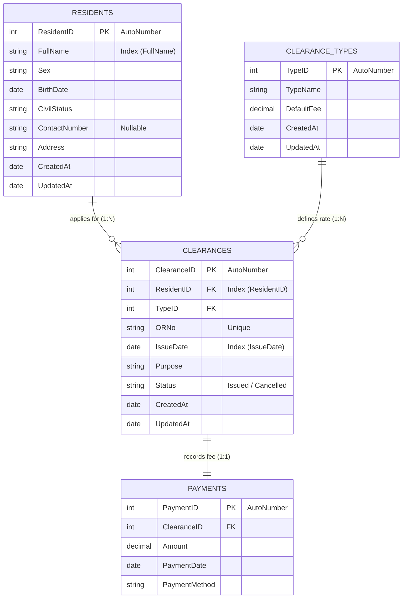

# 🏛️ Barangay Clearance & Residents Registry System

<p align="center">
  
  
  
  
</p>

---

## 🎥 Project Demonstration Video

> [!TIP]
> Watch the comprehensive 7-minute walk-through of the application demonstrating CRUD operations, database transaction failure simulations, advanced search, and dynamic layout-clipped landscape reports.
>
> ### 🔗 [Click Here to View the Video on Google Drive](https://drive.google.com/file/d/1ydH7buSUyraQNK2HLuvv3GlvKpqD6n6r/view?usp=sharing)

<p align="center">
  <a href="https://drive.google.com/file/d/1ydH7buSUyraQNK2HLuvv3GlvKpqD6n6r/view?usp=sharing" target="_blank">
    
  </a>
</p>

---

## 📖 Table of Contents
* [🎥 Project Demonstration Video](#-project-demonstration-video)
* [👩‍💻 Developers](#-developers)
* [📝 Project Goal & Description](#-project-goal--description)
* [🎯 Grading Anchor Compliance Checklist](#-grading-anchor-compliance-checklist)
* [🗄️ Database Schema Details](#️-database-schema-details)
* [📂 Project Structure & Layout](#-project-structure--layout)
* [🔄 CRUD Operations](#-crud-operations)
* [⚙️ Technical Features & Data Patterns](#️-technical-features--data-patterns)
* [🚀 Getting Started & Setup](#-getting-started--setup)
* [🖥️ User Guide & Operations](#️-user-guide--operations)
* [🔧 Troubleshooting](#-troubleshooting)
* [📄 License & Course Information](#-license--course-information)

---

## 👩‍💻 Developers

| Role | Developer Name | Student Details |
| :---: | :--- | :--- |
| Lead Developer | 👩‍💻 **Karylle Jamie L. Marimon** | IT 313 Student |
| Database Engineer / Co-Developer | 👩‍💻 **Krizel Anecita B. Perucho** | IT 313 Student |

* **🏫 Academic context**: IT 313 Final Group Project (Database CRUD App)
* **📅 Academic Year**: 2025

---

## 📝 Project Goal & Description

The **Barangay Clearance & Residents Registry System** is an enterprise-grade **Windows Forms (MDI) desktop application** written in **VB.NET 2022**. It fulfills all grading anchors for the IT 313 Database CRUD App guidelines. 

The application establishes a dynamic connection to an **MS Access (`.accdb`)** relational database using **ADO.NET (`System.Data.OleDb`)**. It implements end-to-end CRUD capabilities across two master tables linked via a foreign key relation to a transactional payments schema. The application features multi-field search and sorting, transactional updates, input validation, and layout-clipped reporting.

---

## 🎯 Grading Anchor Compliance Checklist

| Feature Anchor | Description | Implementation Status |
| :--- | :--- | :---: |
| **🗃️ Multiple Master Tables** | `Residents` & `ClearanceTypes` linked to `Clearances` (FK). | 🟢 **Complete** |
| **🔍 Multi-Field Search** | Parameterized search with text boxes, date ranges, and status dropdowns. | 🟢 **Complete** |
| **🔀 User-Selected Sorting** | Dynamic sorting of data grid values using safe `ORDER BY` inputs. | 🟢 **Complete** |
| **🔒 Database Transactions** | Combined insertion of clearance record + payment ledger using `OleDbTransaction`. | 🟢 **Complete** |
| **⚠️ UI Form Validation** | Input length checks, required field asterisks, and `ErrorProvider` alerts. | 🟢 **Complete** |
| **🖨️ Landscape Printing** | Custom pages printed via `PrintDocument` with ellipsis overflow bounds. | 🟢 **Complete** |
| **🕒 Audit Records** | Automatic population of `CreatedAt` and `UpdatedAt` timestamps. | 🟢 **Complete** |
| **🌱 Seed Data** | Pre-populated with **20+ master rows** and **30+ transaction records**. | 🟢 **Complete** |

---

## 🗄️ Database Schema Details

The application automatically initializes the database using the following relational table schema:



---

## 📂 Project Structure & Layout

Here is a breakdown of the directories and primary code files:

📁 **Barangay Clearance & Residents Registry/**  
├── 📄 `Barangay Clearance & Residents Registry.sln` — *Visual Studio Solution File*  
├── 📜 `db_setup.sql` — *Relational Schema & 50+ Row Seed Script*  
├── 🔒 `.gitignore` — *Ignore rules for build outputs (`bin`, `obj`) and MS Access locking files (`.laccdb`)*  
└── 📁 **Barangay Clearance & Residents Registry/**  
&nbsp;&nbsp;&nbsp;&nbsp;├── 📄 `Barangay Clearance & Residents Registry.vbproj` — *MSBuild Configurations*  
&nbsp;&nbsp;&nbsp;&nbsp;├── 🗄️ `App.accdb` — *MS Access Relational Database Template*  
&nbsp;&nbsp;&nbsp;&nbsp;├── 📁 **Infrastructure/**  
&nbsp;&nbsp;&nbsp;&nbsp;│&nbsp;&nbsp;&nbsp;└── 📄 `DbHelper.vb` — *Centralized ADO.NET wrapper (Query/Exec/Transaction)*  
&nbsp;&nbsp;&nbsp;&nbsp;├── 📁 **Shell/**  
&nbsp;&nbsp;&nbsp;&nbsp;│&nbsp;&nbsp;&nbsp;├── 📄 `FrmMain.vb` — *MDI Container Shell containing menu strips*  
&nbsp;&nbsp;&nbsp;&nbsp;│&nbsp;&nbsp;&nbsp;└── 📄 `FrmDashboard.vb` — *Dashboard analytics displaying counters*  
&nbsp;&nbsp;&nbsp;&nbsp;└── 📁 **Modules/**  
&nbsp;&nbsp;&nbsp;&nbsp;&nbsp;&nbsp;&nbsp;&nbsp;├── 📁 **Residents/**  
&nbsp;&nbsp;&nbsp;&nbsp;&nbsp;&nbsp;&nbsp;&nbsp;│&nbsp;&nbsp;&nbsp;├── 📄 `FrmResidentsList.vb` — *Resident profiles registry grid*  
&nbsp;&nbsp;&nbsp;&nbsp;&nbsp;&nbsp;&nbsp;&nbsp;│&nbsp;&nbsp;&nbsp;└── 📄 `FrmResidentEdit.vb` — *Add/Modify resident dialog*  
&nbsp;&nbsp;&nbsp;&nbsp;&nbsp;&nbsp;&nbsp;&nbsp;├── 📁 **Templates/**  
&nbsp;&nbsp;&nbsp;&nbsp;&nbsp;&nbsp;&nbsp;&nbsp;│&nbsp;&nbsp;&nbsp;├── 📄 `FrmClearanceTypesList.vb` — *Certificate type presets grid*  
&nbsp;&nbsp;&nbsp;&nbsp;&nbsp;&nbsp;&nbsp;&nbsp;│&nbsp;&nbsp;&nbsp;└── 📄 `FrmClearanceTypeEdit.vb` — *Add/Modify template fee dialog*  
&nbsp;&nbsp;&nbsp;&nbsp;&nbsp;&nbsp;&nbsp;&nbsp;└── 📁 **Clearances/**  
&nbsp;&nbsp;&nbsp;&nbsp;&nbsp;&nbsp;&nbsp;&nbsp;&nbsp;&nbsp;&nbsp;&nbsp;├── 📄 `FrmClearancesList.vb` — *Clearance issuance transactions list*  
&nbsp;&nbsp;&nbsp;&nbsp;&nbsp;&nbsp;&nbsp;&nbsp;&nbsp;&nbsp;&nbsp;&nbsp;└── 📄 `FrmClearanceEdit.vb` — *New Clearance payment dialog*  

---

## 🔄 CRUD Operations

The system implements strict Create, Read, Update, and Delete patterns across all tables with full parameter safety:

### ➕ Create (Insert)
Inserts new records using parameterized command objects:
```vb
Dim sql As String = "INSERT INTO Residents (FullName, Sex, BirthDate, CivilStatus, ContactNumber, Address, CreatedAt, UpdatedAt) VALUES (?, ?, ?, ?, ?, ?, Now(), Now())"
Dim params As New List(Of OleDbParameter) From {
    New OleDbParameter("@name", OleDbType.VarWChar) With {.Value = name},
    New OleDbParameter("@sex", OleDbType.VarWChar) With {.Value = sex},
    New OleDbParameter("@birth", OleDbType.Date) With {.Value = birthDate},
    New OleDbParameter("@civil", OleDbType.VarWChar) With {.Value = civilStatus},
    New OleDbParameter("@phone", OleDbType.VarWChar) With {.Value = If(String.IsNullOrEmpty(phone), DBNull.Value, phone)},
    New OleDbParameter("@addr", OleDbType.VarWChar) With {.Value = address}
}
DbHelper.Exec(sql, params)
```

### 🔍 Read (Select & Filter)
Populates grids with dynamic filters, date ranges, and user-selectable sorting (SQL Injection Safe):
```vb
Dim where As New List(Of String)
Dim params As New List(Of OleDbParameter)

If Not String.IsNullOrWhiteSpace(txtName.Text) Then
    where.Add("FullName LIKE ?")
    params.Add(New OleDbParameter("@name", "%" & txtName.Text.Trim() & "%"))
End If

Dim sql = "SELECT * FROM Residents"
If where.Count > 0 Then
    sql &= " WHERE " & String.Join(" AND ", where)
End If
sql &= " ORDER BY " & cboSort.SelectedItem.ToString()
Dim dt As DataTable = DbHelper.GetTable(sql, params)
```

### 📝 Update
Saves modifications to the database after form-level validation rules pass:
```vb
Dim sql As String = "UPDATE Residents SET FullName = ?, Sex = ?, BirthDate = ?, CivilStatus = ?, ContactNumber = ?, Address = ?, UpdatedAt = Now() WHERE ResidentID = ?"
Dim params As New List(Of OleDbParameter) From {
    New OleDbParameter("@name", name),
    New OleDbParameter("@sex", sex),
    New OleDbParameter("@birth", birthDate),
    New OleDbParameter("@civil", civilStatus),
    New OleDbParameter("@phone", If(String.IsNullOrEmpty(phone), DBNull.Value, phone)),
    New OleDbParameter("@addr", address),
    New OleDbParameter("@id", residentId)
}
DbHelper.Exec(sql, params)
```

### ❌ Delete & Referential Integrity
Before executing any delete statement, the system queries referencing tables to enforce database safety rules:
```vb
' Check references first
Dim count As Integer = Convert.ToInt32(DbHelper.ExecScalar("SELECT COUNT(*) FROM Clearances WHERE ResidentID = ?", New List(Of OleDbParameter) From {New OleDbParameter("@id", id)}))
If count > 0 Then
    MessageBox.Show("Cannot delete resident with active clearance records.", "Referential Integrity", MessageBoxButtons.OK, MessageBoxIcon.Warning)
    Return
End If

' Safe to delete if no referencing records
DbHelper.Exec("DELETE FROM Residents WHERE ResidentID = ?", New List(Of OleDbParameter) From {New OleDbParameter("@id", id)})
```

---

## ⚙️ Technical Features & Data Patterns

### 1. Centralized ADO.NET Layer (`DbHelper.vb`)
Centralizes connection pooling, parameter addition, and command executions:
* **Query Execution**: `GetTable` downloads tabular datasets safely.
* **Non-Queries**: `Exec` handles single insertions, updates, and deletions.
* **Scalars**: `ExecScalar` retrieves counts, collections sums, and single values.

### 2. Multi-Step Database Transactions
The clearance registry uses atomic operations wrapping both `Clearances` and `Payments` updates. If one fails, the entire transaction rolls back cleanly:
```vb
Using tx = cn.BeginTransaction()
    Try
        ' Insert Clearance ...
        ' Insert Payment ...
        If simulateError Then Throw New Exception("Simulated Failure")
        tx.Commit()
    Catch ex As Exception
        tx.Rollback()
        Throw
    End Try
End Using
```

### 3. Precision Landscape Printing
Custom drawing handles overflow dynamically by drawing elements in specific clipping rectangles and applying ellipsis suffixes on overflow text values:
```vb
Using sf As New StringFormat() With {.Trimming = StringTrimming.EllipsisCharacter, .FormatFlags = StringFormatFlags.NoWrap}
    g.DrawString(r("Clearance Type").ToString(), fontBody, Brushes.Black, New RectangleF(xStart, y, colWidth, rowHeight), sf)
End Using
```

---

## 🚀 Getting Started & Setup

### 📋 Prerequisites
1. **IDE**: [Visual Studio 2022](https://visualstudio.microsoft.com/vs/) with the **.NET Desktop Development** workload.
2. **Runtime Engine**: Install [Microsoft Access Database Engine 2016 Redistributable (ACE OLE DB)](https://www.microsoft.com/en-us/download/details.aspx?id=54920) (Select x64 or x86 matching your machine target).

### 🛠️ Quick Installation
1. Clone the repository:
   ```bash
   git clone https://github.com/kaka-bear/Barangay-Clearance-Residents-Registry.git
   cd Barangay-Clearance-Residents-Registry
   ```
2. Build the project using .NET CLI:
   ```bash
   dotnet build
   ```
3. Run the application:
   ```bash
   dotnet run --project "Barangay Clearance & Residents Registry"
   ```

---

## 🖥️ User Guide & Operations

### 👥 1. Managing Residents
* Go to **Maintenance** $\rightarrow$ **Residents Registry**.
* To add: Click **➕ Add New**, populate the fields (fields marked with `*` are validated), and save.
* To search: Input characters in the search bar, specify civil status or sex filters, choose a sorting option, and click **Search**.

### 📜 2. Managing Clearance Templates
* Go to **Maintenance** $\rightarrow$ **Clearance Types**.
* Add or update certificate templates (e.g. "Barangay Clearance", "Indigency Certificate") and define default processing fees.

### 💳 3. Issuing Certificates & Simulating Security
* Go to **Transactions** $\rightarrow$ **Clearances Registry** $\rightarrow$ **➕ Issue Clearance**.
* Select a resident, choose the clearance type, enter the OR number, and set the payment method.
* **Rollback Demonstration**: Check the **"Simulate Transaction Failure (Force Rollback)"** box and click **Issue**. An exception will be triggered, demonstrating that neither the clearance nor payment records are written to the database. Uncheck it to post both items successfully.

> [!IMPORTANT]
> The database transaction guarantees that if the payment fail-save simulation triggers a rollback, no orphaned record is left behind inside either the `Clearances` or `Payments` table.

### 🖨️ 4. Printing Reports
* Click **🖨️ Print List** on the Residents module or **🖨️ Print Report** on the Clearances module to load landscape document previews. Total collections and records are computed at the bottom of the clearance log report.

---

## 🔧 Troubleshooting

> [!WARNING]
> **OLE DB Provider Architecture Mismatch**  
> **Symptom**: `Microsoft.ACE.OLEDB.12.0 provider is not registered on the local machine`.  
> **Resolution**: Go to project build properties $\rightarrow$ Set **Platform Target** to match the installed driver bitness (choose `x64` for 64-bit Access installations, or `x86` for 32-bit systems).

> [!TIP]
> **Database Locks**  
> Close Microsoft Access database file previewers when running the debug shell to prevent concurrent access lockouts.

---

## 📄 License & Course Information

* **License**: Coursework submission for **IT 313 (Database CRUD App)** under the supervision of:
  * **Prepared By**: **VERDICT L. GONZALES** (Course Instructor)
  * **Checked By**: **CLYDEN CHARL B. ALIBANIA, PhD** (College Dean)
* **Educational Scope**: Academic Use Only.
