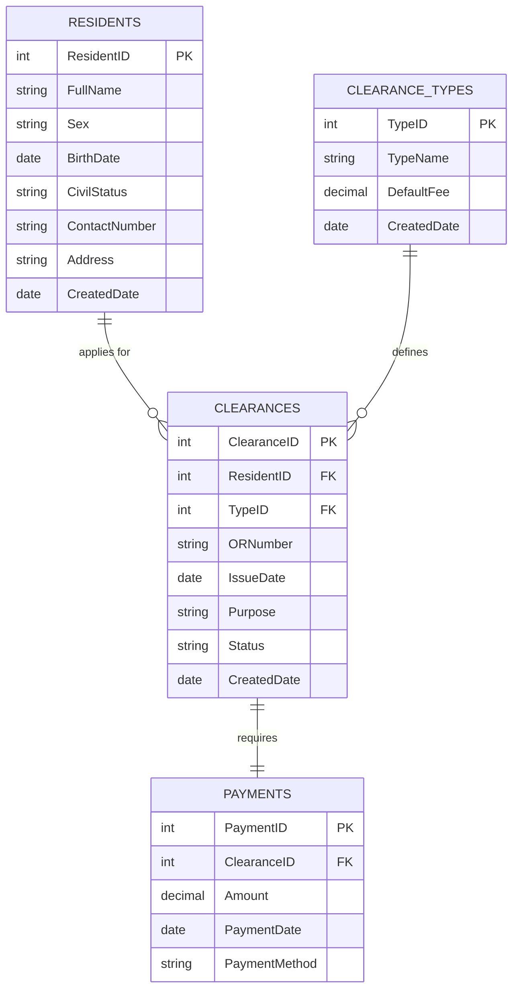

# 🏛️ Barangay Clearance & Residents Registry System

An elegant, robust, and responsive Windows Forms (MDI) desktop application developed in **VB.NET 2022** and **.NET 10.0-windows**. The system provides end-to-end management of resident registries, clearance template settings, collection ledgers, and secure transaction workflows with MS Access database integration.

---

## 👥 Authors & Project Credits

* **Developed By**: 
  * 👩‍💻 **Karylle Jamie L. Marimon**
  * 👩‍💻 **Krizel Anecita B. Perucho**
* **Project**: IT 313 Final Group Project (Database CRUD App)
* **Academic Year**: 2025

---

## 📖 Project Description

The **Barangay Clearance & Residents Registry System** is designed to digitize and streamline municipal administration tasks. By replacing manual record-keeping, it allows local government staff to securely manage resident profiles, configure certificate templates, process clearance applications, issue receipts, and print reports in real time. 

Built on a multi-layer ADO.NET and MS Access architecture, the application prioritizes database integrity through transactional rollbacks, type-safe queries, and responsive Windows Forms layouts suitable for different resolution scales.

---

## ✨ Key Features

1. **Analytical Dashboard**:
   * Displays real-time summary cards for Total Residents, Clearances Issued, and Total Collections.
   * Features a live feed of the 5 most recent clearance transactions.
2. **Resident Registry Module (Master Table 1)**:
   * Full CRUD suite supporting additions, modifications, filtering, and sorting of resident profiles.
   * Built-in referential integrity protection prevents the deletion of a resident with active transaction records.
3. **Clearance Template Manager (Master Table 2)**:
   * Custom templates (e.g., Barangay Clearance, Business Permit, Indigency Certificate) with customizable fee rates.
4. **Clearance Issuance & Multi-step Transactions (Foreign Key Link)**:
   * Issues clearances tied to specific resident records and records payments atomically.
   * Enforces unique Official Receipt (OR) Number validation.
5. **Security Rollback Simulation**:
   * An interactive diagnostic checkbox lets developers simulate system failures to demonstrate atomic transaction rollbacks (reverts partial records).
6. **Landscape Printing & Reporting**:
   * Custom print layouts formatted for landscape pages featuring pagination headers and automated collection aggregates.
7. **Fluid/Responsive UI**:
   * Custom MDI layout container with dynamic anchoring, auto-centering forms, and `MinimumSize` bounds to prevent element overlapping.

---

## 🗄️ Database Architecture

The system connects to an **MS Access (`.accdb`)** database engine using the `System.Data.OleDb` provider.



---

## 📂 Project Structure

```
Barangay Clearance & Residents Registry/
│
├── Barangay Clearance & Residents Registry.sln  # Visual Studio Solution
├── db_setup.sql                                 # Database Schema & Seed Data SQL Script
│
└── Barangay Clearance & Residents Registry/
    ├── Barangay Clearance & Residents Registry.vbproj # MSBuild Project Config
    ├── App.accdb                                # Template Access Database
    │
    ├── Infrastructure/
    │   └── DbHelper.vb                          # Database access wrapper & transaction controller
    │
    ├── Shell/
    │   ├── FrmMain.vb                           # MDI Parent Shell Form
    │   └── FrmDashboard.vb                      # Dashboard Analytics Form
    │
    ├── Modules/
    │   ├── Residents/
    │   │   ├── FrmResidentsList.vb              # Residents Grid list form
    │   │   └── FrmResidentEdit.vb               # Add/Edit Resident dialog
    │   │
    │   ├── Templates/
    │   │   ├── FrmClearanceTypesList.vb         # Clearance types registry
    │   │   └── FrmClearanceTypeEdit.vb          # Add/Edit Template dialog
    │   │
    │   └── Clearances/
    │       ├── FrmClearancesList.vb             # Clearance logs registry
    │       └── FrmClearanceEdit.vb              # New Clearance issuance dialog
    │
    └── Resources/                               # Icons and graphic resources
```

---

## 🚀 Getting Started & Quick Setup

### Prerequisites
* **IDE**: Microsoft Visual Studio 2022.
* **SDK**: .NET 10.0 SDK or higher.
* **Database Driver**: [Microsoft Access Database Engine Redistributable](https://www.microsoft.com/en-us/download/details.aspx?id=54920) (ensure the version matching your Office/System architecture: x64 or x86).

### Fast Setup
1. **Clone the Repository**:
   ```bash
   git clone https://github.com/your-username/barangay-clearance-residents-registry.git
   cd "Barangay Clearance & Residents Registry"
   ```
2. **Build the Application**:
   Using the .NET CLI:
   ```bash
   dotnet build
   ```
3. **Run the Project**:
   ```bash
   dotnet run --project "Barangay Clearance & Residents Registry"
   ```

---

## ⚙️ Configuration & Connection

* **Connection String**: The connection is managed dynamically in [DbHelper.vb](file:///c:/Users/Mike%20Ryno%20Santiago/source/repos/Barangay%20Clearance%20&%20Residents%20Registry/Barangay%20Clearance%20&%20Residents%20Registry/DbHelper.vb). It determines the current running directory of the application:
  ```vb
  Dim dbPath As String = Path.Combine(AppDomain.CurrentDomain.BaseDirectory, "App.accdb")
  Dim connStr As String = $"Provider=Microsoft.ACE.OLEDB.12.0;Data Source={dbPath};"
  ```
* **Database Seeding**: On the first start, if the database file is present but contains no tables, `DbHelper` parses the `db_setup.sql` script (removing SQL line comments automatically) and populates the database with default structures and 20+ demo entries.

---

## 🖥️ User Guide & Verification

1. **Dashboard Overview**: Access analytics summary cards showing statistics of the municipality. View the recent activity log grid.
2. **Register a Resident**:
   * Navigate to **Maintenance** $\rightarrow$ **Residents Registry**.
   * Click **➕ Add New**, fill out details, and save. Verify that input errors are caught in real time by the validation indicators.
3. **Issue a Clearance (Atomic Transaction)**:
   * Navigate to **Transactions** $\rightarrow$ **Clearances Registry** $\rightarrow$ **➕ Issue Clearance**.
   * Select a resident, a clearance type, enter a unique **OR Number**, choose a payment method, and click **Issue / Pay**.
4. **Test Security Rollback**:
   * Open the **➕ Issue Clearance** dialog.
   * Populate details, check **"Simulate Transaction Failure (Force Rollback)"**, and save.
   * A simulated exception will fire midway. Verify that no clearance or payment records are written.
5. **Print Reports**:
   * Click the **🖨 Print** buttons on the Registry views. Verify that pages print in landscape layout with column ellipsis trimming and collection totals automatically calculated.

---

## 🛠️ Technical Details & Security Controls

* **Option Strict On**: The codebase strictly enforces type-safety constraints, preventing unsafe implicit narrowing conversions.
* **Explicit OleDbParameter Types**: All data queries map parameter types explicitly (using `OleDbType.VarWChar`, `Integer`, `Decimal`, `Date`) rather than relying on implicit typing, eliminating common Access parameter alignment errors.
* **SQL Comment Filter**: Centralized logic strips SQL comments (`--`) dynamically during initialization, preventing execution failures with legacy MS Access drivers.
* **Ellipsis Print Column Wrapping**: Cell-level string formatting restricts print text overflows, truncating values cleanly with a `...` suffix when a cell length is exceeded.

---

## 🔧 Troubleshooting

| Issue | Cause | Resolution |
| :--- | :--- | :--- |
| **"Microsoft.ACE.OLEDB.12.0 provider is not registered..."** | Missing OLE DB driver or 32/64-bit architecture mismatch. | Install Microsoft Access Database Engine Redistributable matching your CPU architecture (x64/x86). |
| **"Database file not found"** | The `App.accdb` file was not copied to the binary folder. | Rebuild the project. Visual Studio automatically copies the database file to the target build directory. |
| **"Duplicate OR Number"** | Validation caught an existing receipt. | Use a unique OR number for new clearances. |

---

## 📜 License & Support

* **License**: Academic Use Only (IT 313 Coursework).
* **Support**: For inquiries or bug submissions, contact the project maintainers or open an issue on the repository.
