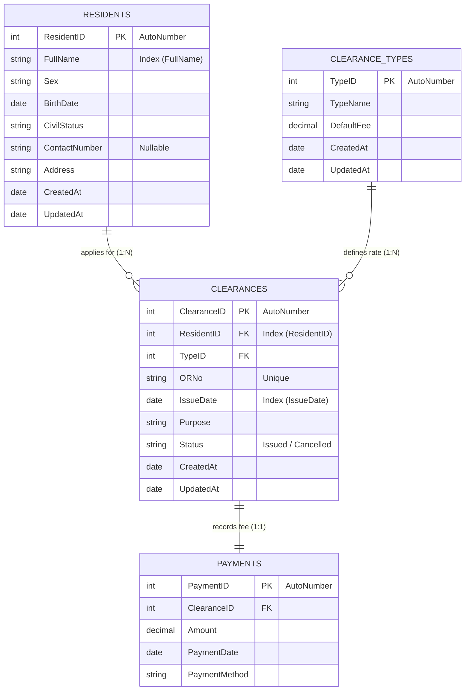

# 🏛️ Barangay Clearance & Residents Registry System

[](https://github.com/kaka-bear/Barangay-Clearance-Residents-Registry)
[](https://github.com/kaka-bear/Barangay-Clearance-Residents-Registry)
[](https://github.com/kaka-bear/Barangay-Clearance-Residents-Registry)
[](https://github.com/kaka-bear/Barangay-Clearance-Residents-Registry)

---

## 👩‍💻 Developers

* 🎓 **Karylle Jamie L. Marimon**
* 🎓 **Krizel Anecita B. Perucho**

* **Course / Project**: IT 313 Final Group Project (Database CRUD App)
* **Academic Year**: 2025

---

## 📝 Project Goal & Description

The **Barangay Clearance & Residents Registry System** is a type-safe **Windows Forms (MDI) desktop application** written in **VB.NET 2022**. It fulfills all grading anchors for the IT 313 Database CRUD App guidelines. 

The application establishes a dynamic connection to an **MS Access (`.accdb`)** relational database using **ADO.NET (`System.Data.OleDb`)**. It implements end-to-end CRUD capabilities across two master tables linked via a foreign key relation to a transactional payments schema. The application features multi-field search and sorting, transactional updates, input validation, and layout-clipped reporting.

---

## 🎯 Grading Anchor Compliance Checklist

* **[x] Multiple Master Tables with FK relations**:
  * **Master Table 1**: `Residents` (Handles all resident profiles)
  * **Master Table 2**: `ClearanceTypes` (Manages certificate templates & fees)
  * **Transactional Table**: `Clearances` (Tied via FK to `Residents` and `ClearanceTypes`)
  * **Sub-Transactional Table**: `Payments` (Linked via FK to `Clearances` for fee settlement)
* **[x] Multi-Field Search & Sort**: Fully parameterized filters (text fields, date range, type dropdowns) with a user-selected `ORDER BY` clause.
* **[x] Secure Database Transactions**: Wraps multi-step writes (inserting a clearance log + posting a payment ledger entry) inside an atomic `OleDbTransaction` with full rollback logic.
* **[x] UI Validation Controls**: Utilizes asterisks and Windows Forms `ErrorProvider` bounds to provide immediate visual warnings for incomplete fields or invalid values.
* **[x] Custom Printing**: Standard landscape print views built using `PrintDocument` and `PrintPreviewDialog` with custom column-width auto-ellipses.
* **[x] Audit Fields**: Fully records `CreatedAt` and `UpdatedAt` timestamps across all core tables.
* **[x] Seed Data**: Pre-seeded with over **20+ rows in master tables** and **30+ rows in the transactional ledger** on initial start.

---

## 🗄️ Database Schema Details

The application automatically creates and seeds the database using the following relational table structures:



---

## 📁 Project Structure & Layout

```
Barangay Clearance & Residents Registry/
│
├── Barangay Clearance & Residents Registry.sln  # Visual Studio Solution File
├── db_setup.sql                                 # Relational Schema & 50+ Row Seed Script
├── .gitignore                                   # Ignore file rules for .NET and MS Access (.laccdb)
│
└── Barangay Clearance & Residents Registry/
    ├── Barangay Clearance & Residents Registry.vbproj # MSBuild Configurations
    ├── App.accdb                                # MS Access Relational Database
    │
    ├── Infrastructure/
    │   └── DbHelper.vb                          # Centralized ADO.NET wrapper (Query/Exec/Transaction)
    │
    ├── Shell/
    │   ├── FrmMain.vb                           # MDI Container Shell containing menu strips
    │   └── FrmDashboard.vb                      # Dashboard analytics displaying counters
    │
    └── Modules/
        ├── Residents/
        │   ├── FrmResidentsList.vb              # Resident profiles registry grid
        │   └── FrmResidentEdit.vb               # Add/Modify resident dialog
        │
        ├── Templates/
        │   ├── FrmClearanceTypesList.vb         # Certificate type presets grid
        │   └── FrmClearanceTypeEdit.vb          # Add/Modify template fee dialog
        │
        └── Clearances/
            ├── FrmClearancesList.vb             # Clearance issuance transactions list
            └── FrmClearanceEdit.vb              # New Clearance payment dialog
```

---

## ⚙️ Technical Features & Data Patterns

### 1. Centralized ADO.NET Layer (`DbHelper.vb`)
Implemented clean parameterized queries to prevent SQL injections and data mismatches:

```vb
' Type-Safe Exec Method Example
Public Shared Function Exec(sql As String, params As List(Of OleDbParameter)) As Integer
    Using cn As New OleDbConnection(GetConnectionString())
        Using cmd As New OleDbCommand(sql, cn)
            For Each p In params
                cmd.Parameters.Add(p)
            Next
            cn.Open()
            Return cmd.ExecuteNonQuery()
        End Using
    End Using
End Function
```

### 2. Multi-Step Database Transactions
The clearance registry uses atomic operations wrapping both `Clearances` and `Payments` updates. If one fails, the entire transaction rolls back cleanly:

```vb
Public Shared Sub SaveClearanceWithPayment(clrID As Integer, resID As Integer, typeID As Integer, orNo As String, issueDate As Date, purpose As String, amount As Decimal, payMethod As String, simulateError As Boolean)
    Using cn As New OleDbConnection(GetConnectionString())
        cn.Open()
        Using tx = cn.BeginTransaction()
            Try
                ' 1. Insert Clearance Record
                Dim sqlClr = "INSERT INTO Clearances (ResidentID, TypeID, ORNo, IssueDate, Purpose, [Status], CreatedAt, UpdatedAt) VALUES (?, ?, ?, ?, ?, 'Issued', Now(), Now())"
                ' [Parameters configured explicitly with OleDbType...]
                
                ' 2. Insert Payment Ledger Entry
                Dim sqlPay = "INSERT INTO Payments (ClearanceID, Amount, PaymentDate, PaymentMethod) VALUES (?, ?, ?, ?)"
                ' [Parameters configured explicitly...]
                
                If simulateError Then Throw New Exception("Simulated Failure")
                
                tx.Commit()
            Catch ex As Exception
                tx.Rollback()
                Throw
            End Try
        End Using
    End Using
End Sub
```

### 3. Precision Landscape Printing
Custom drawing handles overflow dynamically by drawing elements in specific clipping rectangles and applying ellipsis suffixes on overflow text values:
```vb
Using sf As New StringFormat() With {.Trimming = StringTrimming.EllipsisCharacter, .FormatFlags = StringFormatFlags.NoWrap}
    g.DrawString(r("Clearance Type").ToString(), fontBody, Brushes.Black, New RectangleF(xStart, y, colWidth, rowHeight), sf)
End Using
```

---

## 🚀 Getting Started & Setup

### 📋 Prerequisites
1. **IDE**: [Visual Studio 2022](https://visualstudio.microsoft.com/vs/) with the **.NET Desktop Development** workload.
2. **Runtime Engine**: Install [Microsoft Access Database Engine 2016 Redistributable (ACE OLE DB)](https://www.microsoft.com/en-us/download/details.aspx?id=54920) (Select x64 or x86 matching your machine target).

### 🛠️ Quick Installation
1. Clone the repository:
   ```bash
   git clone https://github.com/kaka-bear/Barangay-Clearance-Residents-Registry.git
   cd Barangay-Clearance-Residents-Registry
   ```
2. Build the project using .NET CLI:
   ```bash
   dotnet build
   ```
3. Run the application:
   ```bash
   dotnet run --project "Barangay Clearance & Residents Registry"
   ```

---

## 🖥️ User Guide & Operations

### 👥 1. Managing Residents
* Go to **Maintenance** $\rightarrow$ **Residents Registry**.
* To add: Click **➕ Add New**, populate the fields (fields marked with `*` are validated), and save.
* To search: Input characters in the search bar, specify civil status or sex filters, choose a sorting option, and click **Search**.

### 📜 2. Managing Clearance Templates
* Go to **Maintenance** $\rightarrow$ **Clearance Types**.
* Add or update certificate templates (e.g. "Barangay Clearance", "Indigency Certificate") and define default processing fees.

### 💳 3. Issuing Certificates & Simulating Security
* Go to **Transactions** $\rightarrow$ **Clearances Registry** $\rightarrow$ **➕ Issue Clearance**.
* Select a resident, choose the clearance type, enter the OR number, and set the payment method.
* **Rollback Demonstration**: Check the **"Simulate Transaction Failure (Force Rollback)"** box and click **Issue**. An exception will be triggered, demonstrating that neither the clearance nor payment records are written to the database. Uncheck it to post both items successfully.

### 🖨️ 4. Printing Reports
* Click **🖨️ Print List** on the Residents module or **🖨️ Print Report** on the Clearances module to load landscape document previews. Total collections and records are computed at the bottom of the clearance log report.

---

## 🔧 Troubleshooting

* **"Microsoft.ACE.OLEDB.12.0 provider is not registered on the local machine"**:
  * *Cause*: Your application is targeting a different CPU architecture than the installed OLE DB database driver.
  * *Fix*: Set the platform target in Visual Studio (e.g., compile as `x64` if your MS Office and Access Engine driver are 64-bit).
* **"Data type mismatch in criteria expression"**:
  * *Cause*: Unmapped parameters or null dates passed implicitly.
  * *Fix*: The project utilizes explicitly mapped `OleDbType` parameters which prevents this exception. Ensure all new queries follow this pattern.

---

## 📄 License & Course Information

* **License**: Coursework submission for **IT 313 (Database CRUD App)** under the supervision of:
  * **Prepared By**: **VERDICT L. GONZALES** (Course Instructor)
  * **Checked By**: **CLYDEN CHARL B. ALIBANIA, PhD** (College Dean)
* **Educational Scope**: Academic Use Only.
